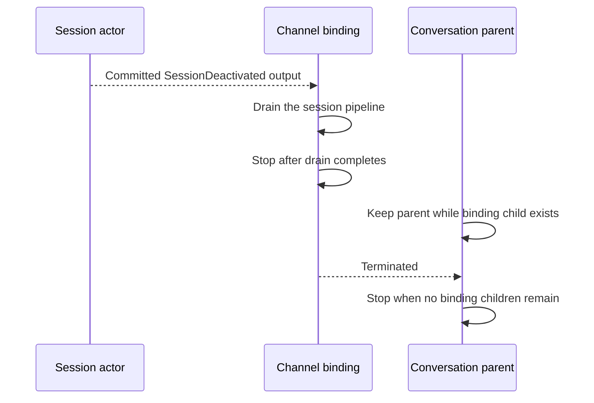

## Context

See [proposal.md](proposal.md). PRD-001 FR-001, FR-002, and FR-003 require stable thread identity, output delivery, and recovery. PRD-009 requires adapters to route through the session boundary. The [engineering glossary](../../../docs/spec/GLOSSARY.md) defines shared terms.

## Goals / Non-Goals

**Goals:**

- Keep session idle policy and active-work state in the session actor.
- Keep each channel binding alive until the session commits to stop.
- Stop a binding after it drains its pipeline on committed session deactivation.
- Keep a conversation parent alive while it has binding children.

**Non-Goals:**

- Change approval passivation or response behavior.

## Decisions

### Session-owned idle eligibility

Reuse the existing session idle timer and set its default to one hour. The session checks actor-local work state before idle passivation. A shell job blocks passivation while its record has no reap timestamp. A reaped record does not block. The current `Processing` phase already disables idle timeout and covers foreground work. Do not query a remote job manager from each timeout. A journaled pending approval alone does not block idle passivation.

Subscriber count does not block idle passivation. The session emits deactivation only after it commits to stop. It does not emit deactivation when passivation can still abort. An approval response can rehydrate a passivated session through the current route.

### Binding lifetime follows session lifetime

Slack, Discord, and Mattermost bindings keep their direct session output subscription while the session is active. They have no independent idle stop. When a binding receives committed `SessionDeactivated`, it drains its pipeline and stops itself. The conversation parent stops after its last binding child terminates. It has no independent idle timer.

During deactivation, pipeline drain does not prove that input in the binding's local queue reached session admission. That input may not survive session stop.

### Approval recovery

Keep current approval behavior. A pending journaled approval does not block idle passivation. The current gateway and conversation route can rehydrate the session when the user responds to a prompt that already reached the channel. A prompt that has not reached the channel depends on the active session and binding path.

## Migration Plan

1. Keep the session-owned idle timeout and active-work guard.
2. Remove independent idle stops from Slack, Discord, and Mattermost bindings.
3. Stop each binding after it drains on committed session deactivation.
4. Keep each conversation parent alive while it has binding children. Stop it after the last child terminates.
5. Verify lifecycle behavior and approval recovery.

Rollback restores independent binding idle stops and the prior session eligibility policy. It does not require a persisted data migration.
